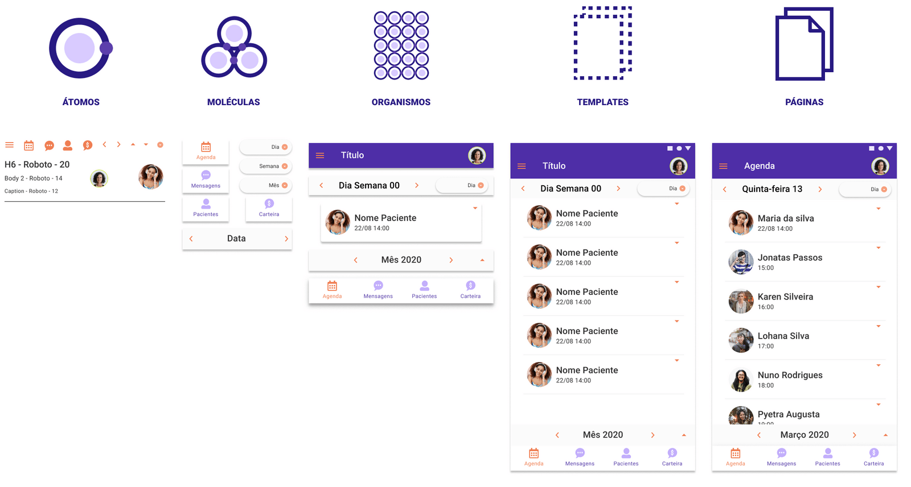

# Atomic Design ⚛️
A metodologia Atomic Design é uma abordagem para criar sistemas de design escaláveis e eficientes, que consiste em dividir as interfaces em componentes menores e mais simples, chamados átomos, que são combinados para formar moléculas, organismos, templates e páginas.

